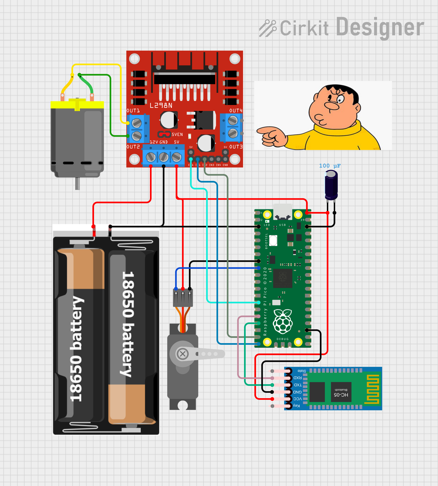

# Pico_RC
Xe RC với Raspberry pi pico. Dự án đơn giản điều khiển xe RC bằng điện thoại hoặc máy tính thông qua Bluetooth. Mã được viết bằng Python và sơ đồ có sẵn.

Tệp main.py sẽ được nạp vào bo mạch pico, sau đó bật kết nối bluetooth trên máy tính và bạn cần chạy control.py trên VSCode. Vui lòng chờ đợi vài giây và quá trình kết nối bắt đầu (có thể nhận biết bằng đèn led trên HC-05 nhấp nháy chậm).

Sau khi kết nối, bạn có thể điều hướng bằng 4 phím mũi tên bên phải bàn phím và điều chỉnh tốc độ di chuyển với 4 tham số 0=stop, 4=65%, 7=80%, 9=100%(PWM).
